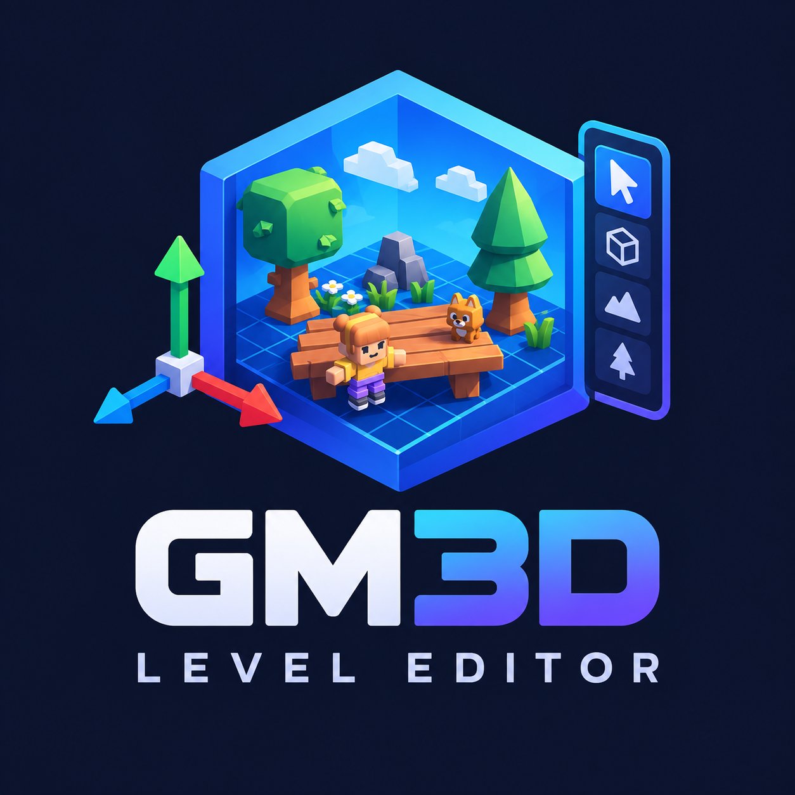
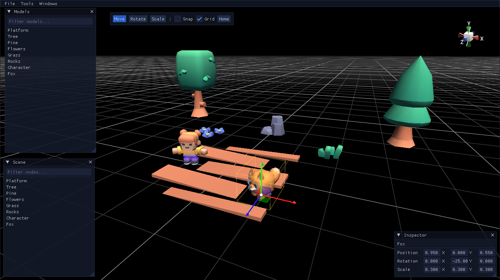

# GameMaker 3D Level Editor



Embeddable 3D level editor for GameMaker (GML) on the GM3D runtime, using the built-in ImGUI interface. The game owns its runtime (scene, camera, models); the editor only drives it through a small adapter. Drop it into a project, wire one gateway object, edit levels in-game, save them as JSON.

## Requirements

- GameMaker with GMRT 0.21 (from the Package Manager)
- Tick "Disable file system sandbox" in Game Options > Windows, or scenes will not be able to be saved/loaded from anywhere.

## Quick start



**1. Import the editor package** — drag `gm3d_editor.yymps` onto the GameMaker IDE to import the scripts. You also need GMRT 0.21 (Package Manager), which provides `GM3D_*` and `ImGui`.

**2. Add an object** with 5 events (full working example in `objects/oEditor`):

```gml
// Create
ed = gm3d_editor_init(id, {
    scene: global.my_scene, // your live GM3D_Scene
    cam: global.my_camera,  // your camera node (the editor flies it while open)
});
gm3d_editor_asset_add(ed, "Tree", my_load_model("models/tree.glb"));
gm3d_editor_load("myscene.json"); // or start empty

// Step
gm3d_editor_step(ed);
if (!gm3d_editor_is_active()) my_game_step(); // live world only while closed

// Draw
my_game_render();

// Draw GUI
if (gm3d_editor_is_active()) gm3d_editor_draw(ed);

// Clean Up
gm3d_editor_cleanup(ed);
```

While the editor is open it owns the camera and the scene: pause your own simulation and resume it in `on_close`. Nodes your game spawns itself can join Scene/Inspector/save/undo via `gm3d_editor_track_node(ed, asset_name, node)`.

## Public API

| Function | Purpose |
|---|---|
| `gm3d_editor_init(self, opts)` | Boot editor state by passing some options like the camera and scene |
| `gm3d_editor_step(ed)` / `gm3d_editor_draw(ed)` | Per-frame update + 3D overlay (gizmo, selection) |
| `gm3d_editor_cleanup(ed)` | Autosave-if-dirty, destroy, cleanup |
| `gm3d_editor_enable/disable/toggle/is_active()` | Open/close the editor (gateway steps the live world while closed) |
| `gm3d_editor_asset_add(ed, name, model)` / `gm3d_editor_asset_clear(ed)` | Models library (names should be unique) |
| `gm3d_editor_track_node(ed, asset, node, label?)` | Adopt a code-spawned instance into Scene/Inspector/save/undo |
| `gm3d_editor_load(fname)` | Load a .scene file |

## Scene file format

`{ "version": 1, "nodes": [...] }`, one descriptor per asset placement:

```json
{
  "kind": "asset",
  "asset": "Tree",
  "name": "Tree 2",
  "position": [1.0, 0.0, 2.0],
  "rotation": [0.0, 0.0, 0.0, 1.0],
  "scale": [1.0, 1.0, 1.0]
}
```

## Controls

| Input | Action |
|---|---|
| F1 | Toggle editor |
| 1 / 2 / 3 | Move / Rotate / Scale tool |
| Left-drag model (Models panel) | Spawn into the scene |
| Left-click / drag | Select (additive rectangle with drag) |
| Right-drag + WASD/QE, wheel, Shift | Fly camera |
| Middle-drag | Pan view in screen space (around the selection if any) |
| F (or double-click in Scene) | Focus selection |
| F2 | Rename (labels are display-only) |
| Arrows | Nudge selection on the ground plane (snap step, undoable) |
| Ctrl (held while dragging) | Temporary snap |
| Del | Delete selection |
| Ctrl+D | Duplicate |
| Ctrl+S / Ctrl+L / Ctrl+N | Save / Load / New scene |
| Ctrl+Z / Ctrl+Y (or Ctrl+Shift+Z) | Undo / Redo |
| Esc | Cancel gesture / rename / close dialog |

## Credits

Demo models by [Kenney](https://kenney.nl) (`kenney_platformer-kit`, `kenney_mini-characters`, `kenney_cube-pets_1.0`), used under [CC0](https://creativecommons.org/publicdomain/zero/1.0/).

## License

MIT — see [LICENSE](LICENSE.md).
