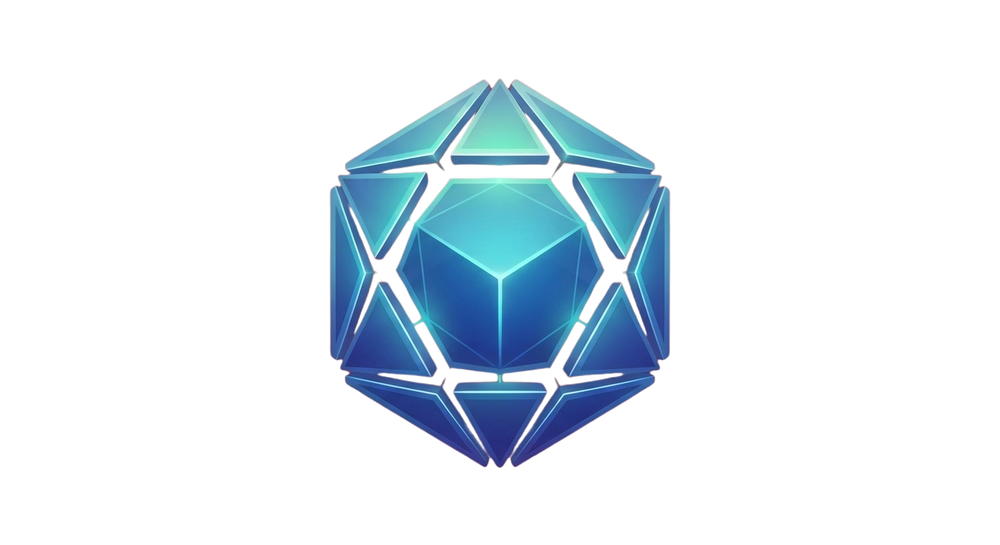
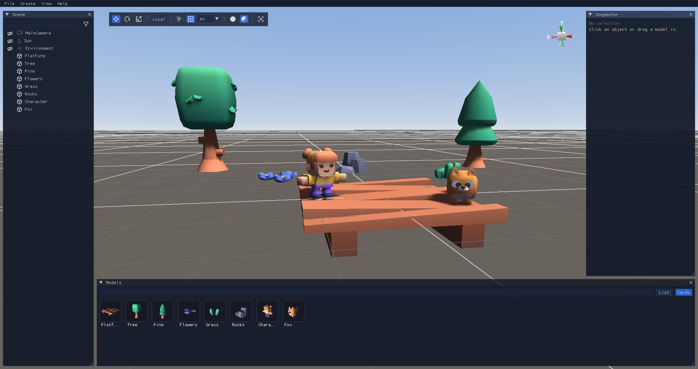

# GameMaker 3D Level Editor



Embeddable 3D level editor for GameMaker on the GM3D runtime, using the built-in ImGUI interface. Drop it into a project, edit levels in-game, save them as a JSON file and you will be able it to load it later.

## Requirements

- GameMaker with GMRT 0.22.1 (from the Package Manager)
- Tick "Disable file system sandbox" in Game Options > Windows, or scenes will not be able to be saved/loaded from anywhere.

## Quick start



**1. Import the editor package** — drag `gm3d_editor.yymps` onto the GameMaker IDE to import the scripts. You also need GMRT 0.22.1 (Package Manager), which provides `GM3D_*` and `ImGui`.

**2. Add an object** with 5 events (full working example in `objects/oEditor`):

```gml
// Create
ed = gm3d_editor_init(id, {
    scene: global.my_scene, // your live GM3D_Scene
    cam: global.my_camera,  // your camera node (the editor flies it while open)
});
gm3d_editor_asset_add(ed, "Tree", my_load_model("models/tree.glb"));
gm3d_editor_track(ed, "asset", "Tree", my_tree_node, "Tree");
gm3d_editor_track(ed, "light", "", my_sun_node, "Sun");

// Step
gm3d_editor_step(ed);
if (!gm3d_editor_is_active()) my_game_step(); // live world only while closed

// Draw
gm3d_editor_prerender(ed);
my_game_render();
gm3d_editor_postrender(ed);

// Draw GUI
gm3d_editor_draw(ed);

// Clean Up
gm3d_editor_cleanup(ed);
```

While the editor is open it owns the camera and the scene: pause your own simulation and resume it in `on_close`. Nodes your game spawns itself can join Scene/Inspector/save/undo via `gm3d_editor_track(ed, kind, asset, node, label?)`, where `kind` is `"asset"`, `"light"`, `"camera"` or `"environment"` (for assets, `asset` is the library name).

## Public API

| Function | Purpose |
|---|---|
| `gm3d_editor_init(self, adapter)` | Boot editor state from `{ scene, cam, on_spawn?, on_close? }` |
| `gm3d_editor_step(ed)` / `gm3d_editor_draw(ed)` | Per-frame update (Step) + 3D overlay in Draw GUI (gizmo, selection) |
| `gm3d_editor_prerender(ed)` / `gm3d_editor_postrender(ed)` | Draw-event hooks around your render: shader warmup, then outline mask + GPU pick |
| `gm3d_editor_cleanup(ed)` | Autosave-if-dirty, destroy, cleanup |
| `gm3d_editor_enable/disable/toggle/is_active()` | Open/close the editor (gateway steps the live world while closed) |
| `gm3d_editor_asset_add(ed, name, model)` / `gm3d_editor_asset_clear(ed)` | Models library (names should be unique) |
| `gm3d_editor_track(ed, kind, asset, node, label?)` | Adopt a code-spawned node into Scene/Inspector/save/undo (`kind` is `"asset"`, `"light"`, `"camera"` or `"environment"`) |
| `gm3d_load(scene, fname, models)` | Load a saved scene into a live game scene (no editor); `models` is `{ asset: loadedModel }`, returns `{ placed, failed }` |

## Scene file format

`{ "version": 1, "nodes": [...] }`, one descriptor per node. Every descriptor has a `kind` (`"asset"`, `"light"`, `"camera"` or `"environment"`; files without `kind` still load as legacy assets):

```json
{
  "kind": "asset",
  "asset": "Tree",
  "name": "Tree 2",
  "position": [1.0, 0.0, 2.0],
  "rotation": [0.0, 0.0, 0.0, 1.0],
  "scale": [1.0, 1.0, 1.0],
  "flags": { "castShadows": true, "receiveShadows": true }
}
```

Lights, cameras and the environment carry a `light` / `camera` / `environment` sub-struct (angles in degrees, colors as `[r, g, b]` 0-255). Directional lights can also carry `shadow: { enabled, resolution, distance, normalOffset }`.

## Shadows

Directional lights support shadow mapping, editable in the Inspector under Shadows; selecting a shadowed light draws its coverage box, and the toolbar Shadows button toggles preview without touching saved values.

Every material needs both a Forward and a Shadow shader, assigned **per live instance** — `spawnInto` clones do not inherit source assignments, so assign them in your spawn hook (the demo does it in `demo_on_spawn`). Use the `sStatic` / `sAnimated` (+`Shadow`) shaders from this project, synced with upstream GM3D-Samples. The editor grid never casts shadows.

## Loading scenes in-game (no editor)

`gm3d_load(scene, fname, models)` spawns a saved scene into any live `GM3D_Scene` without the editor. Load and freeze each model once, then pass them as `{ asset: model }` — the `asset` field of each descriptor is the key into this struct, while `name` is just the instance label:

```gml
var _models = {
    Tree: my_load_model("models/tree.glb"),
    Rock: my_load_model("models/rock.glb"),
};
var _rep = gm3d_load(my_scene, "level1.json", _models);
// _rep = { placed: 9, failed: 0 } — unknown assets count as failed, the rest still loads
// After loading, assign Forward+Shadow shaders per spawned node (see Shadows above).
```

## Controls

| Input | Action |
|---|---|
| F1 | Toggle editor |
| F9 | Toggle FPS readout (editor must be open) |
| 1 / 2 / 3 | Move / Rotate / Scale tool |
| Left-drag model (Models panel) | Spawn into the scene |
| Left-click / drag | Select (additive rectangle with drag) |
| Alt + left-drag | Orbit around the current view point |
| Right-drag + W/S forward/back, A/D left/right, Q/E down/up, Shift | Fly camera; wheel adjusts fly speed |
| Alt + right-drag / wheel | Zoom view |
| Middle-drag | Pan view in screen space (around the selection if any) |
| F (or double-click in Scene) | Focus selection |
| F2 | Rename (labels are display-only) |
| Arrows | Nudge selection on the ground plane (snap step, undoable) |
| Ctrl (held while dragging) | Temporary snap |
| Del | Delete selection |
| Ctrl+D | Duplicate |
| Ctrl+S / Ctrl+L / Ctrl+N | Save / Load / New scene |
| Ctrl+Z / Ctrl+Y (or Ctrl+Shift+Z) | Undo / Redo |
| Esc | Cancel gesture / rename / close dialog |

## Credits

Demo models by [Kenney](https://kenney.nl) (`kenney_platformer-kit`, `kenney_mini-characters`, `kenney_cube-pets_1.0`), used under [CC0](https://creativecommons.org/publicdomain/zero/1.0/).

## License

MIT — see [LICENSE](LICENSE.md).
