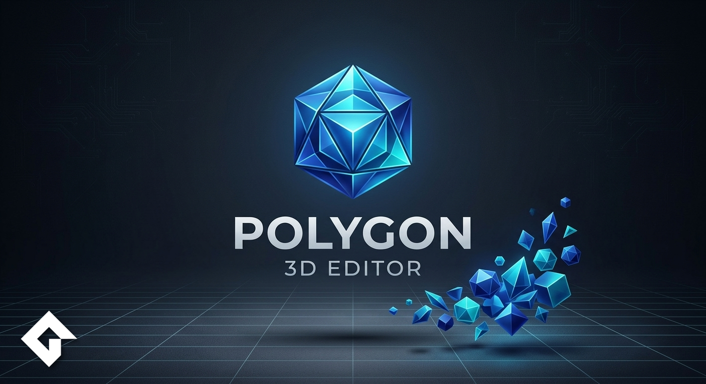

# Polygon - 3D Editor for Game Maker



3D editor for GameMaker on the GMRT runtime, using the built-in GM3D/ImGUI classes. Drop it into a project, edit your scenes, save them to a file and you will be able it to load it later anywhere.

## Requirements

- GameMaker with GMRT 0.22.4 (from the Package Manager)

## Quick start


**1. Import the editor package** - drag `editor.yymps` onto the GameMaker IDE to import the scripts. You also need GMRT 0.22.4 (Package Manager), which provides `GM3D_*` and `ImGui`.

**2. Add the `oEditor` package object to your game.** It is editor-only: your game hands over a runtime adapter, then creates it (full working example in `oGame`):

```gml
// Game Create
var assets = [
  { model: my_load_model("tree.glb"), path: "tree.glb" },
  { model: my_load_model("rock.glb"), path: "rock.glb", label: "Rock" }, // optional display label
];

polygon_init({
  scene: global.my_scene,
  assets,
  cam: global.my_camera,
  on_spawn: my_on_spawn, // assign shaders to freshly spawned nodes
});

// Game Step
if (!polygon_is_active()) my_game_step(); // live world only while closed

// Game Draw
if (!polygon_is_active()) my_game_render(); // editor shows its own viewport

// Game Clean Up
my_game_destroy();
```

While the editor is open it works on its own scene copy: what you edit never touches the game world. Save to JSON and reload deterministically with `polygon_load` when the game wants it. The editor boots disabled; the game opens it with `polygon_enable()` and closes it with `polygon_disable()`.

## Public API

| Function                                                           | Purpose                                                                                                                   |
| ------------------------------------------------------------------ | ------------------------------------------------------------------------------------------------------------------------- |
| `polygon_init(adapter)`                                        | Boot static editor state from `{ scene?, assets?, cam?, on_spawn?, on_close? }`: owns its scene (empty at boot; the live `scene` is mirrored as copies on every enable, else camera/sun/env defaults spawn) |
| `polygon_step()` / `polygon_draw()`                        | Per-frame update (Step) + 3D overlay in Draw GUI (gizmo, selection)                                                       |
| `polygon_render()`                                                 | Draw-event hook (used by the `oEditor` Draw event): shader warmup, outline mask + GPU pick                              |
| `polygon_cleanup()`                                            | Autosave-if-dirty, destroy, cleanup                                                                                       |
| `polygon_enable/disable/is_active()`                                 | Open/close the editor (gateway steps the live world while closed)                                                         |
| `polygon_asset_add(model, kind?, label?, path?)` / `polygon_asset_clear()` | Library entry, identified by relative load `path` (models with duplicate root names can coexist; `label` is display-only) / clear library |
| `polygon_track(kind, asset, node, label?)`                     | Import one live game node into the editor scene as a copy (`asset` is the model path) |
| `polygon_load(scene, fname, models)`                                  | Load a saved scene into a live game scene (no editor); `models` is `{ asset: loadedModel }`, returns `{ placed, failed }` |

## Scene file format

`{ "version": 2, "seq": 14, "nodes": [...] }`, one descriptor per node. Every descriptor has a `kind` (`"instance"`, `"light"`, `"camera"` or `"environment"`), an `id`, a `label` (display name) and a generic `asset` field:

```json
{
  "kind": "instance",
  "id": "__PolygonEditor__7",
  "label": "Tree 2",
  "asset": "models/tree.glb",
  "position": [1.0, 0.0, 2.0],
  "rotation": [0.0, 0.0, 0.0, 1.0],
  "scale": [1.0, 1.0, 1.0],
  "flags": { "castShadows": true, "receiveShadows": true }
}
```

Lights, cameras and the environment carry a `light` / `camera` / `environment` sub-struct (angles in degrees, colors as `[r, g, b]` 0-255). Directional lights can also carry `shadow: { enabled, resolution, distance, normalOffset }`.

## Shadows

Directional lights support shadow mapping, editable in the Inspector under Shadows; selecting a shadowed light draws its coverage box, and the toolbar Shadows button toggles preview without touching saved values.

Every material needs both a Forward and a Shadow shader, assigned **per live instance** - `spawnInto` clones do not inherit source assignments, so assign them in your spawn hook (the demo does it in `demo_on_spawn`). Use the `sStatic` / `sAnimated` (+`Shadow`) shaders from this project.

## Loading scenes in-game (no editor)

`polygon_load(scene, fname, models)` spawns a saved scene into any live `GM3D_Scene` without the editor. Load and freeze each model once, then pass them as `{ asset: model }` - the `asset` field of each descriptor is the key into this struct (the relative load path, e.g. `"models/tree.glb"`), while `label` is just the display name. Assets spawn inside a wrapper node named after the descriptor `id`, so a later editor enable preserves identity; walk the subtree in your spawn hook (the `on_spawn` contract is: first arg is the wrapper):

```gml
var _models = {};
_models[$ "models/tree.glb"] = my_load_model("models/tree.glb");
_models[$ "models/rock.glb"] = my_load_model("models/rock.glb");
polygon_load(my_scene, "__PolygonEditor__/scenes/level1.json", _models);
// After loading, assign Forward+Shadow shaders per spawned node (see Shadows above).
```

## AI bridge (MCP)

`other/mcp-relay` is a Node.js MCP server (Claude Code, Codex, …) that drives
the live editor over local TCP: 13 tools for status, hierarchy, selection,
details, assets, select, focus, create, transform, rename, delete, save and
batched edits. Enable it with the AI button at the right end of the menu bar while the
editor is open (default port 5192, loopback only, off by default). Every edit
goes through the editor's own functions and stays undoable. Full setup,
protocol and troubleshooting in `other/mcp-relay/README.md`.

## Controls
| Input                                                             | Action                                                    |
| Ctrl + W                                                          | Close editor                                              |
| 1 / 2 / 3 / 4                                                     | View / Move / Rotate / Scale tool                         |
| Left-drag model (Models panel)                                    | Spawn into the scene                                      |
| Left-click / drag                                                 | Select (additive rectangle with drag)                     |
| Alt + left-drag                                                   | Orbit around the current view point                       |
| Right-drag + W/S forward/back, A/D left/right, Q/E down/up, Shift | Fly camera; wheel adjusts fly speed                       |
| Alt + right-drag / wheel                                          | Zoom view                                                 |
| Middle-drag                                                       | Pan view in screen space (around the selection if any)    |
| F (or double-click in Scene)                                      | Focus selection                                           |
| F2                                                                | Rename (labels are display-only)                          |
| Arrows                                                            | Nudge selection on the ground plane (snap step, undoable) |
| Ctrl (held while dragging)                                        | Temporary snap                                            |
| Del                                                               | Delete selection                                          |
| Ctrl+D                                                            | Duplicate                                                 |
| Ctrl+S / Ctrl+L / Ctrl+N                                          | Save / Load / New scene                                   |
| Ctrl+Z / Ctrl+Y (or Ctrl+Shift+Z)                                 | Undo / Redo                                               |
| Esc                                                               | Cancel gesture / rename / close dialog                    |

## Credits

Demo models by [Kenney](https://kenney.nl) (`kenney_platformer-kit`, `kenney_mini-characters`, `kenney_cube-pets_1.0`), used under [CC0](https://creativecommons.org/publicdomain/zero/1.0/).

## License

MIT - see [LICENSE](LICENSE.md).
